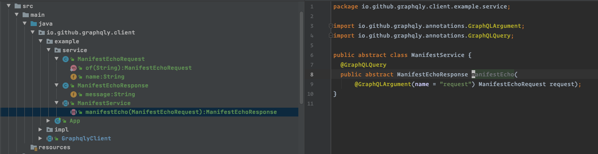

# vertx-graphql-client

*An elegant implementation for code-first GraphQL clients using graphql-reflector & vertx*

## Overview

This code-first implementation is a deadly simple GraphQL client

## Installation

Please add `vertx-graphql-client` to your Maven projects

```
<dependency>
    <groupId>io.github.graphqly</groupId>
    <artifactId>vertx-graphql-client</artifactId>
    <version>0.1.0</version>
</dependency>
```


## Usage

You can see demo code in [example](src/main/java/io/github/graphqly/client/example/App.java)

## Demo


### Prepare

This following demo code assumes that you're already had a GraphQL service as followed:

```graphql
input ManifestEchoRequest{
  name: String
}

type ManifestEchoResponse{
  # The output message will be: "Hello " + request.name
  message: String
}

type Query {
  manifestEcho(request: ManifestEchoRequest): ManifestEchoResponse
}
```

Make sure it can be reached at: `http://localhost:4000/graphql`

### Integrate

It's easy to define our abstract class ManifestService 



You may see the similarities between our Java class and the GraphQL definition above.

The code:

```java
GraphqlClient client = GraphqlClient.newBuilder()
        // Optionally set the endpoint
        // Default: http://localhost:4000/graphql 
        .endpoint("http://localhost:4000/graphql")
        
        // Optionally set keep-alive for our http connection
        // Default: true
        .keepAlive(true)
        
        // Optionally set if we need to use SSL
        // Default: false
        .useSSL(false)
        
        // Optionally set User-Agent string
        // Default: graphqly/0.1.0
        .userAgent("demo")
        
        // Optionally set vertx instance
        // Default: null (auto-created later)
        .vertx(vertx)
        .build();

Future<ManifestEchoResponse> response =
    client.callDefault(
        ManifestService.class,
        "manifestEcho",
        ManifestEchoRequest.of("Andy"),
        ManifestEchoResponse.class);

response.setHandler(
    ar -> {
      if (ar.succeeded()) {
        System.out.println(ar.result().message);
      }
    });
```

## Demo

```bash
mvn compile
mvn exec:java -Dexec.mainClass="io.github.graphqly.client.example.App" -Dlog4j.configurationFile=log4j2.xml
```

You may see following output:

```text
Hello Andy
```